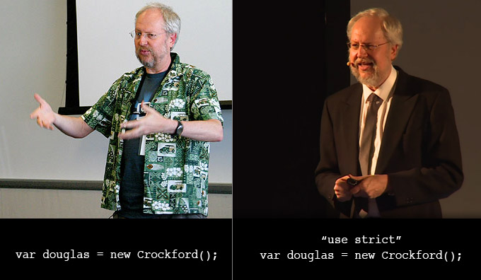

LearnJavaScript: A list of resources
====================================

This list was inspired by (a now defunct) [discussion](http://www.linkedin.com/groupItem?view=&gid=121615&item=5909742634301140992&type=member&commentID=5909826380652113920&trk=eml-ntf-hero-like-my-discussion-cmt&midToken=AQG2dgaKId8xLA&fromEmail=fromEmail&ut=2sQj9Dud2coCo1#commentID_5909826380652113920) on LinkedIn's Javascript group.

*(Quote by the lovely [MPJ](https://twitter.com/mpjme?lang=en))*

---

### Table of Contents (work in progress)  

- [1. Learning](#learning)
- [2. Suggested Coding Rules & Best Practices](#2-suggested-coding-rules-and-best-practices)
- [3. Resources](#3-resources)
	- [3.1 Beginner Resources](#31-beginner-resources--updated)
		- [3.1.1 Courses](#311-courses--updated)
		- [3.1.2 Testing Code](#312-testing-code)
		- [3.1.3 APIs](#313-apis)
	- [3.2 General Resources](#32-general)
	- [Functional Programming](#functional-programming-reading)
		- [Reading](#functional-programming-reading)
		- [Video](#functional-programming-video)
		- [Video](#functional-programming-libraries)
	- [3.3 Node.JS](#33-nodejs)
	- [3.4 Frameworks & Libraries](#34-frameworks-and-libraries)
		- [3.4.1 Backbone.js](#backbonejs)
		- [3.4.2 jQuery](#)
		- [3.4.3 Angular & AngularJS](#)
		- [3.4.4 Ember](#)
		- [3.4.5 Knockout.js](#)
		- [3.4.6 React.js & Redux](#reactjs)
	- [3.5 Books](#35-books)
	- [3.6 Online Books](#36-online-books)
	- [3.7 Video & Audio](#37-video--audio)	
	- [3.8 Newsletters](#38-newsletters)
	- [3.9 Developers](#39-developers)
	- [work in progres...](#)
	- [3.10 Tools](#310-tools)
	- [3.11 JS Compiled Languages](#311-javascript-compiled-languages)

- [Maintainers](#maintainers)
- [Contributors](#contributors)

---

<!-- L E A R N I N G -->

### LEARNING

* Understand [type coercion](https://github.com/getify/You-Dont-Know-JS/blob/2nd-ed/types-grammar/ch2.md)
* Get a good understaning of `Functions`, [`Scope` and `Hoisting`](http://justinchmura.com/2014/08/20/become-a-better-javascript-developer/) 

  - Understand exactly how non-primitive types are [passed to functions as arguments](http://dmitrysoshnikov.com/ecmascript/chapter-8-evaluation-strategy/#call-by-value).

  - Here are some really good resources explaining scope and hoisting:
    * [JavaScript Visualized: Hoisting](https://dev.to/lydiahallie/javascript-visualized-hoisting-478h), By [Lydia Hallie](https://github.com/lydiahallie)
    * [JavaScript Visualized: Scope (Chain)](https://dev.to/lydiahallie/javascript-visualized-scope-chain-13pd), By [Lydia Hallie](https://github.com/lydiahallie)
    * [**Scope in JavaScript** - HTTP 203](https://www.youtube.com/watch?v=5LEuJNLfLN0)
 
* Understand how `undefined` and `null` behave and how [they differ](https://2ality.com/2021/01/undefined-null-revisited.html). 
- Study `Objects`,  
  * [`Prototypal Inheritance` and `OOP`](http://manuel.kiessling.net/2012/03/23/object-orientation-and-inheritance-in-javascript-a-comprehensive-explanation/)  
  * [**OLOO**: Objects Linked to Other Objects](https://github.com/getify/You-Dont-Know-JS/blob/1st-ed/this%20%26%20object%20prototypes/ch6.md)
  * [**JavaScript Visualized: Prototypal Inheritance**](https://dev.to/lydiahallie/javascript-visualized-prototypal-inheritance-47co)
  * [**Marcus Phillips: Secrets and Lies about JavaScript classes** (Low-quality video but definitely worth watching)](https://www.youtube.com/watch?v=_JJgSbuj5VI)
* Make sure to understand **callbacks**, **IIFEs** and [**asynchronicity**](https://github.com/kostasx/LearnJavascript#async) as they are some of the most commonly encountered and crucial concepts in JS 
  * Callbacks in JavaScript:
    * [Callbacks in JavaScript](https://zellwk.com/blog/callbacks/)
    * [Callback function (MDN)](https://developer.mozilla.org/en-US/docs/Glossary/Callback_function)
    * [JavaScript: What the heck is a Callback?](https://codeburst.io/javascript-what-the-heck-is-a-callback-aba4da2deced)
  * Immediately Invoked Function Expression (IIFEs):
    * [IIFE (MDN)](https://developer.mozilla.org/en-US/docs/Glossary/IIFE)
    * [Immediately Invoked Function Expression - Beau teaches JavaScript](https://www.youtube.com/watch?v=3cbiZV4H22c)
    * [The IIFE Pattern (Video by Kyle Simpson)](https://frontendmasters.com/courses/javascript-foundations/iife-pattern/)
  * Asynchronous Programming in JavaScript:
    * [**Asynchronous Programming** (Excellent post)](https://eloquentjavascript.net/11_async.html)
    * [**JavaScript Visualized: Promises & Async/Await** (Excellent post)](https://dev.to/lydiahallie/javascript-visualized-promises-async-await-5gke)
* Study the source code of popular libraries: [jQuery](http://jquery.com/), [underscore](http://underscorejs.org/), etc. 

  Here are 2 great videos on the subject by Paul Irish: 
  * [10 Things I Learned from the jQuery Source](http://www.youtube.com/watch?v=i_qE1iAmjFg)
  * [11 More Things I Learned from the jQuery Source](http://www.youtube.com/watch?v=ARnp9Y8xgR4)
* Read (_or preferably buy_) every single book of the excellent [**You Don't Know JS**](https://github.com/getify/You-Dont-Know-JS) series by [Kyle simpson](https://twitter.com/getify) **[MUST READ]**
* Watch every video by [Douglas Crockford](https://www.youtube.com/results?search_query=douglas+crockford).
* Take the full course ['JavaScript The Good Parts'](http://frontendmasters.com/courses/javascript-the-good-parts/#toc) by Douglas Crockford on [Front End Masters](http://frontendmasters.com)
* Get a really good understanding of [closures](https://kostasx.github.io/LearnJavascript/external/JavaScript-Garden/index.html#function.closures) and [this](https://kostasx.github.io/LearnJavascript/external/JavaScript-Garden/index.html#function.this) 
  * [**JavaScript Closures are Super Simple!** (YouTube Video: 16 min)](https://www.youtube.com/watch?v=2cRjcXwsG0I)
  * [**JavaScript the Hard Parts: Closures, Scope, and Execution Context** (Student Approved Resource)](https://www.youtube.com/watch?v=ZVXrJ4dnUxM)
  * [**Understanding Functions and 'this'** By Bryan Hughes](https://www.youtube.com/watch?v=AOSYY1_np_4)

* Study performance and code optimization

  Here is a good article by Nicholas Zakas: 
  * [10 Javascript Performance Boosting Tips](http://jonraasch.com/blog/10-javascript-performance-boosting-tips-from-nicholas-zakas)
  * [**The cost of JavaScript in 2019** By Addy Osmani](https://v8.dev/blog/cost-of-javascript-2019)

* Check every tip on the [A Drip of JavaScript](http://designpepper.com/js-drip-archive/) list and subscribe to it.
* Check the _(archived version)_ of an old but good resource: [JavaScript Garden](https://kostasx.github.io/LearnJavascript/external/JavaScript-Garden/index.html).

	**JavaScript Garden** *is a growing collection of documentation about the most quirky parts of the JavaScript programming language. It gives advice to avoid common mistakes and subtle bugs, as well as performance issues and bad practices, that non-expert JavaScript programmers may encounter on their endeavours into the depths of the language.*

* Read some books. You can find some great books for JS on the BOOKS section of this list.
* Learn how to debug your JS code. Here are some good links as a starting point:

  * [Debugging JavaScript](https://developer.chrome.com/devtools/docs/javascript-debugging)
  * [Chrome DevTools Command Line API Reference](https://developer.chrome.com/devtools/docs/commandline-api)

* Study general Software Design Patterns along with JavaScript-specific Patterns and Anti-Patterns:

  * [Learning JavaScript Design Patterns, Addy Osmani](http://addyosmani.com/resources/essentialjsdesignpatterns/book/)
  * [Javascript Patterns, moderated by *Shi Chuan*](http://shichuan.github.io/javascript-patterns/)
  * [Frontend architecture: Decoupling apps from frameworks (DevFest 2019)](https://www.youtube.com/watch?v=jmcx3b78V8s)

* Understand the Single Threaded Process & Event Loop. 

  * [Concurrency model and Event Loop, MDN](https://developer.mozilla.org/en-US/docs/Web/JavaScript/Guide/EventLoop)
  * [The JavaScript Event Loop: Explained, By Erin  Swenson-Healey](http://blog.carbonfive.com/2013/10/27/the-javascript-event-loop-explained/)
  * [Understanding the node.js event loop, by *Mixu*](http://blog.mixu.net/2011/02/01/understanding-the-node-js-event-loop/)
  * [Introduction to Javascript Processes, by *Nico Valencia *](http://quickleft.com/blog/introduction-to-javascript-processes)
  * [How JavaScript Timers Work, By John Resig](http://ejohn.org/blog/how-javascript-timers-work/)
  * [Philip Roberts: Help, I'm stuck in an event-loop: How JavaScript actually works](http://vimeo.com/96425312)

* Study some of the modern APIs: [WebRTC](https://developer.mozilla.org/en-US/docs/Web/Guide/API/WebRTC), [File API](https://developer.mozilla.org/en-US/docs/Web/API/File), [Blob API](https://developer.mozilla.org/en-US/docs/Web/API/Blob), etc. 
* [Master `Regular Expressions`](#regex). 
* Get in the habit of testing. **(Crucial!)**. [QUnit](http://qunitjs.com/) is a good starting point. 
* Subscribe to these great YouTube channels and watch every video you can:

  * [CascadiaJS](https://www.youtube.com/user/cascadiajs)
  * [JSConf](https://www.youtube.com/user/jsconfeu/videos)
 
* Learn some framework or library like [jQuery](http://jquery.com/), [React](https://reactjs.org/), [Angular](https://angular.io/), [Vue.JS](https://vuejs.org/), [SVELTE](https://svelte.dev/), [Backbone.JS](http://backbonejs.org/), [underscore](http://underscorejs.org/), [AngularJS](https://angularjs.org/), [Ember](http://emberjs.com/), [Knockout.JS](http://knockoutjs.com/), etc. 
* [Try building a ToDo App using one of these libraries](http://todomvc.com/)
* Get to know [Node.JS](http://nodejs.org/) and start building apps. 
  * Try running server-side JS code usign `Node.JS` on [Runnable.com](http://runnable.com/)
  * Install [Node.JS](http://nodejs.org/) locally and start experimenting.
* Subscribe to Newsletters and stay up to date with JS and Node. *(See section `3.8 NEWSLETTERS`)*
* Become familiar with a Task Manager like [Grunt](http://gruntjs.com/) or [Gulp](#gulp) and/or learn how to use [npm scripts](https://www.freecodecamp.org/news/introduction-to-npm-scripts-1dbb2ae01633/).
* Learn how to use Module Bundlers like [WebPack](https://webpack.js.org/), [Parcel](https://parceljs.org/), [Browserify](http://browserify.org/) and [other](#build_tools).
* Start building cross-platform Desktop Applications using HTML/CSS/JavaScript in [Electron.JS](https://electronjs.org/) or [Node-Webkit](https://nwjs.io/).
* Follow some of the masters on Twitter. *(See `section 3.6` of the RESOURCES section)*
* Code using a [Style Guide](https://github.com/airbnb/javascript). 
* [And, of course, you definitely need to learn **TypeScript**!](#3112-typescript--updated)

### 2. SUGGESTED CODING RULES AND BEST PRACTICES

* Always use `let` or `const` when declaring variables. Avoid using `var`.
* [Code using `"use strict"`](http://justinchmura.com/2014/08/20/become-a-better-javascript-developer/) 
* If you are using [VSCode Editor](https://code.visualstudio.com/) add the `//@ts-check` comment at the top of your code for an extra layer of checks via  [TypeScript Linter](https://raw.githubusercontent.com/kostasx/LearnJavascript/master/img/ts-check.jpg)
* [Always use semicolons.](https://kostasx.github.io/LearnJavascript/external/JavaScript-Garden/index.html#core.semicolon) // [**Not using semicolons??? Lonely Island uses them everyday**](https://www.youtube.com/watch?v=M94ii6MVilw)
  * [Here's a little bit of **advice for the semicolon haters** (by Ben Alman)](http://benalman.com/news/2013/01/advice-javascript-semicolon-haters/)
* [Prefer using `===` over `==`](https://kostasx.github.io/LearnJavascript/external/JavaScript-Garden/index.html#types.equality) 
* Always use curly braces 
* Comment your code
* [Avoid/Reduce global variables](http://justinchmura.com/2014/08/20/become-a-better-javascript-developer/) 
* Avoid using `with()` 
* [Avoid using `eval()`](https://dev.to/spukas/everything-wrong-with-javascript-eval-35on)
* Pass functions instead of strings to setTimeout or setInterval, as this triggers eval() internally. 
* Use [JSHint](http://www.jshint.com/) / [JSLint](http://www.jslint.com/)
  * If you are using [VSCode](https://code.visualstudio.com/) you can add the following comment at the top of your code to enable type checking: `//@ts-check` ([See screenshot](https://github.com/kostasx/LearnJavascript/blob/master/README.md#tscheck))  
  * [Inline lint highlighting for the Sublime Text 2 editor](https://github.com/SublimeLinter/SublimeLinter-for-ST2)
  * [Interactive code linting framework for Sublime Text 3](https://github.com/SublimeLinter/SublimeLinter3)
* [Study and apply Software Principles such as **DRY**, **SOLID**, **KISS**, etc.](https://dev.to/pluralsight/my-5-favorite-software-design-principles-4ech)

*The difference between JavaScript and JavaScript with __use strict__*

	
<strong>ECMASCRIPT 6 | ES2015 [ UPDATED ]</strong>

	
<a href="https://scrimba.com/g/ges6"><strong>Learn modern JavaScript</strong> | Scrimba Interactive Screencasts | 54min</a>

	
<a href="https://scrimba.com/g/gintrotoes6"><strong>Introduction to ES6+</strong> | Scrimba Interactive Screencasts | 67min</a>

	
<a href="https://ponyfoo.com/articles/es6"><strong>ES6 Overview in 350 Bullet Points</strong></a>

	
<a href="https://github.com/lukehoban/es6features"><strong>Overview of ECMAScript 6 features</strong></a>

### 3. RESOURCES

#### 3.1 BEGINNER RESOURCES [ UPDATED ]

* [**Introduction to JavaScript** \| Scrimba Interactive Screencasts \| 69min ](https://scrimba.com/g/gintrotojavascript)
* [**Just JavaScript** Course By Dan Abramov and Maggie Appleton](https://justjavascript.com/)
* [**JavaScript First Steps** \| MDN](https://developer.mozilla.org/en-US/docs/Learn/JavaScript/First_steps)
* [**What Is JavaScript Made Of?**](https://overreacted.io/what-is-javascript-made-of/)
* [JavaScript the Right Way](https://github.com/braziljs/js-the-right-way)
* [**JavaScript Basics** A quick introduction to basic and important concepts of JavaScript](https://fkling.github.io/jsbasics/)
* [JavaScript For Cats, *by Max Ogden*](http://jsforcats.com/)
* [JavaScript Guide, MDN](https://developer.mozilla.org/en-US/docs/Web/JavaScript/Guide)
* [Introduction to JavaScript - 24 Interactive Screencasts](https://scrimba.com/g/gintrotojavascript)
* [Learn modern JavaScript - ES6 through Interactive Screencasts](https://scrimba.com/g/ges6)
* [Introduction to ES6+ - 23 Interactive Screencasts](https://scrimba.com/g/gintrotoes6)
* [JavaScript and Node Fundamentals: A Collection of Essential Basics, *by Azat Mardan*](https://pepa.holla.cz/wp-content/uploads/2016/07/JavascriptAndNodeFundametals.pdf)
* [5 Tips to Become a Better JavaScript Developer, *by JUSTIN CHMURA*](http://justinchmura.com/2014/08/20/become-a-better-javascript-developer/)
* [JS 101](http://www.teaching-materials.org/javascript/)
* [Things Every Javascript Developer Should Know, by Lubomir Vitol](http://www.devbattles.com/en/sand/post-1427-Things+Every+Javascript+Developer+Should+Know)
* [JavaScript Idiosyncrasies](https://github.com/miguelmota/javascript-idiosyncrasies)
* [JavaScript Questions](https://github.com/lydiahallie/javascript-questions)
* [What the f*ck JavaScript?](https://github.com/denysdovhan/wtfjs)
* [Airbnb JavaScript Style Guide](https://github.com/airbnb/javascript)
* [Context or the "This" Keyword in JavaScript, *by Adam Breindel*](https://thenewcircle.com/s/post/1564/context_or_the_this_keyword_in_javascript_tutorial)
* [45 Useful JavaScript Tips, Tricks and Best Practices](https://modernweb.com/45-javascript-tips-tricks-practices/)
* [JavaScript DevDocs](http://devdocs.io/javascript/)
* [**How to Become a Great JavaScript Developer***](http://blog.ustunozgur.com/javascript/programming/books/videos/2015/06/17/how_to_be_a_great_javascript_software_developer.html)
* [FAQ for comp.lang.javascript](http://pointedears.de/scripts/faq/cljs/)
* **Archived Resources** _(links that are no longer available and only accessible via archive.org)_:
  * [7 JavaScript Basics Many Developers Aren't Using (Properly)](https://web.archive.org/web/20150314040207/https://tech.pro/tutorial/1453/7-javascript-basics-many-developers-aren-t-using-properly) 
  * [Javascript: BEST PRACTICES PART 1, *by Christian Heilmann*](https://web.archive.org/web/20200615000455/https://www.thinkful.com/learn/javascript-best-practices-1/) / [Part 2](https://web.archive.org/web/20200802075107/https://www.thinkful.com/learn/javascript-best-practices-2/)

##### 3.1.1 COURSES [ UPDATED ]

* [**Deep Dive Into Modern Web Development** \| Full Stack course by The University of Helsinki ](https://fullstackopen.com/en/)
* [CodeCombat: Learn to Code by Playing a Game](http://codecombat.com/)
* [Javascript for Beginners, Udemy **PAID COURSE**](https://www.udemy.com/beginning-javascript/)

##### 3.1.2 TESTING CODE

* [JSBin](http://jsbin.com/)
* [JSFiddle](http://jsfiddle.net/)
• [16 ONLINE JS EDITORS](http://codecondo.com/16-online-javascript-editors-for-web-developers/)

##### 3.1.3 APIs

* [**Web APIs**](https://developer.mozilla.org/en-US/docs/Web/API)
* [A presentation about several HTML5 APIs](http://eventloop.gr/frontend/html5/apis.html#/) (Contains useful links, code and resources in the slides)
* [Screen Orientation API](http://www.sitepoint.com/introducing-screen-orientation-api/)

#### 3.2 GENERAL

* [**Learn Javascript resources on MDN**](https://developer.mozilla.org/en/learn/javascript)
* [Essential JavaScript Links,A curated list by Eric Elliott and friends](https://gist.github.com/ericelliott/d576f72441fc1b27dace/0cee592f8f8b7eae39c4b3851ae92b00463b67b9)
* [JavaScript Garden](https://kostasx.github.io/LearnJavascript/external/JavaScript-Garden/index.html)
* [Learn JavaScript Essentials (for all skill levels), by Eric Elliott](https://medium.com/javascript-scene/learn-javascript-b631a4af11f2)
* [JavaScript, The Right Way](https://www.jstherightway.org/)
* [Dos and Donts: Best Practices When Learning JavaScript](https://www.youtube.com/watch?v=zILmbcIYnfw)
* [The site of Dr. Axel Rauschmayer](https://www.2ality.com/)
* [David Walsh's Blog](https://davidwalsh.name/)
* [Understand JavaScript Closures With Ease](http://javascriptissexy.com/understand-javascript-closures-with-ease/)
* [JavaScript and the Browser: Under the Hood, *by Ariya Hidayat*](https://speakerdeck.com/ariya/javascript-and-the-browser-under-the-hood)
* [JSdo It: Share JavaScript, HTML5 and CSS.](http://jsdo.it/)
* [Explore JavaScript: Popular and new libraries, top authors and trending discussions](https://kandi.openweaver.com/explore/javascript)
* [DailyJS](https://medium.com/dailyjs)

> ES6 (EcmaScript 2015)

* [A tutorial to JavaScript Arrow Functions **(Flavio Copes)**](https://flaviocopes.com/javascript-arrow-functions/)
* [Arrow functions, the basics **(JavaScript.info)**](https://javascript.info/arrow-functions-basics)
* [Arrow functions revisited **(JavaScript.info)**](https://javascript.info/arrow-functions) 

> PERFORMANCE

* [JavaScript Performance Analysis: Keeping the Big Picture, *by Ariya Hidayat*](http://calendar.perfplanet.com/2013/javascript-performance-big-picture/)
* [Speeding up JavaScript: Working with the DOM](https://developers.google.com/speed/articles/javascript-dom)
* [Javascript optimization – high performance JS apps](http://www.mellowmorning.com/2008/05/18/javascript-optimization-high-performance-js-apps/)
* [Writing Efficient JavaScript: Chapter 7 - Even Faster Websites, *by Nicholas C. Zakas*](http://oreilly.com/server-administration/excerpts/even-faster-websites/writing-efficient-javascript.html)
* [A Couple of Quick Tips for JavaScript Optimization](https://mondaybynoon.com/a-couple-of-quick-tips-for-javascript-optimization/)
* [CSS TRIGGERS](http://csstriggers.com/)

> TAMING <a href="#async" id="async">THE ASYNCHRONOUS NATURE OF JAVASCRIPT</a> [ UPDATED ]

* [**Asynchronous JavaScript: From Callback Hell to Async and Await**](https://www.toptal.com/javascript/asynchronous-javascript-async-await-tutorial)
* [**Promises** YouTube video by MPJ (Fun Fun Function) \| 17min ](https://www.youtube.com/watch?v=2d7s3spWAzo)
* [**Promises, async/await @ JavaScript.info**](https://javascript.info/async)
* [**Async JS Crash Course - Callbacks, Promises, Async Await** YouTube video by Traversy Media \| 25min ](https://www.youtube.com/watch?v=PoRJizFvM7s)
* [**async / await in JavaScript - What, Why and How - Fun Fun Function** YouTube video \| 24min](https://www.youtube.com/watch?v=568g8hxJJp4)
* [**Asynchronous JavaScript with async/await**](https://egghead.io/courses/asynchronous-javascript-with-async-await)
* [**JavaScript Goes Asynchronous (and It’s Awesome)**](http://www.sitepoint.com/javascript-goes-asynchronous-awesome/)
* [**Write Better JavaScript with Promises**, By Landon Schropp](http://davidwalsh.name/write-javascript-promises)
* [**The Evolution of Asynchronous JavaScript**](https://blog.risingstack.com/asynchronous-javascript/)
* [**Javascript Async Control Flow**, By KENNY KAYE \| 20 OCTOBER 2015](https://kaye.us/javascript-async-control-flow/)

<!-- D E B U G G I N G -->

	
<strong>DEBUGGING</strong>

	<ul>
	<li><a href="https://developer.chrome.com/devtools/docs/javascript-debugging">Debugging JavaScript</a></li>
	<li><a href="https://developer.chrome.com/devtools/docs/commandline-api">Chrome DevTools Command Line API Reference</a></li>
	</ul>

<!-- L I N T E R S -->

	
<strong>LINTERS</strong>

	<ul>
	<li><a href="http://www.jslint.com/">JSLINT</a></li>
	<li><a href="http://www.jshint.com/">JSHINT Linter</a></li>
	<li><a href="http://eslint.org/">ESLINT Linter</a></li>
	<li><a href="https://www.npmjs.org/package/jscs">JSCS</a></li>
	</ul>

<!-- R E G U L A R  E X P R E S S I O N S -->

	
<strong>REGULAR EXPRESSIONS [ UPDATED ]</strong>

	
<a href="https://www.youtube.com/watch?v=VrT3TRDDE4M">Regular Expressions in JavaScript - #1 REGEX ULTRA BASICS | YouTube Video | 23min </a>

	
<a href="https://www.youtube.com/watch?v=bgBWp9EIlMM" >Regular Expressions - Enough to be Dangerous | YouTube Video | 15min</a>

	
<a href="https://www.youtube.com/watch?v=ZfQFUJhPqMM">Learn Regular Expressions (Regex) - Crash Course for Beginners @freeCodeCamp | YouTube Video | 45min</a>

	
<a href="https://scrimba.com/g/gregularexpressions">Learn Regular Expressions | Interactive Screencases @ Scrimba | 48min</a>

> ADVANCED

* [JavaScript language advanced Tips & Tricks](https://code.google.com/p/jslibs/wiki/JavascriptTips)
* [Byte saving techniques: a collection of JavaScript wizardry that can shave bytes off of your code](https://github.com/jed/140bytes/wiki/Byte-saving-techniques)
* [Advanced JavaScript Techniques](http://www.slideshare.net/Dmitry.Baranovskiy/advanced-javascript-techniques)
* [MetaJS: Visualize JavaScript AST Execution](http://int3.github.io/metajs/)
* [Philip Roberts: What the heck is the event loop anyway? \| JSConf EU 2014](https://www.youtube.com/watch?v=8aGhZQkoFbQ)

#### FUNCTIONAL PROGRAMMING: **READING**

* [**An Intro to Functional Programming Concepts in JavaScript**, By Thomas Collardeau ](https://medium.com/@collardeau/intro-to-functional-programming-concepts-in-javascript-b0650773139c#.8bp7dkyvm)
* [**Why Curry Helps**, By Hugh FD Jackson](https://hughfdjackson.com/javascript/why-curry-helps/)
* [**Functional Programming in Javascript** An interactive learning course by Jafar Husain](http://jhusain.github.io/learnrx/)
* [**Recursion in Functional JavaScript**, By M. David Green](http://www.sitepoint.com/recursion-functional-javascript/)
* [**Functional Programming**, By Scott Sauyet](http://scott.sauyet.com/Javascript/Talk/FunctionalProgramming/)
* [Ramda + ramda-fantasy REPL](https://github.com/hemanth/ramda-repl)

#### FUNCTIONAL PROGRAMMING: **VIDEO**

* [**Intro to Recursion - Refactoring to a Pure Function**, By Shanon Osbourne](https://egghead.io/lessons/javascript-intro-to-recursion-the-problem)
* [**Functional programming and curry cooking in JS** By Stefanie Schirmer \| JSConf EU 2015**](https://www.youtube.com/watch?v=6Qx5ZAbfqjo)
* [**Next-level functional Javascript with Ramda**, By Warren Seymour](https://vimeo.com/129549453)
* [**Pure, functional JavaScript**, By Christian Johansen](https://vimeo.com/43382919)
* [**Lenses Quick n' Dirty: Functional Lenses in javascript**, By Brian Lonsdorf](https://vimeo.com/104807358)

#### FUNCTIONAL PROGRAMMING: **LIBRARIES**

* [**Ramda.JS**](http://ramdajs.com/)
* [**Lodash.JS**](https://lodash.com/)
* [**Underscore.JS**](http://underscorejs.org/)

#### 3.3 NODEJS

	
BEGINNERS <strong><em>(Updated)</em></strong>

     
        <ul>
 	    <li><a href="https://medium.com/@LindaVivah/the-beginners-guide-understanding-node-js-express-js-fundamentals-e15493462be1">THE BEGINNER’S GUIDE: Understanding Node.js & Express.js fundamentals</a></li>
            <li><a href="https://github.com/substack/stream-adventure"><strong>Stream Adventure:</strong> Go on an educational stream adventure!</a></li>
            <li><a href="https://github.com/finnp/test-anything"><strong>test-anything:</strong> Learn to test anything with TAP</a></li>
            <li><a href="http://code.tutsplus.com/tutorials/node-js-for-beginners--net-26314">Node.js for Beginnersby Maciej Sopyło</a></li>
            <li><a href="http://nodeschool.io/">Node School</a></li>
            <li><a href="http://code.tutsplus.com/articles/resources-to-get-you-up-to-speed-in-nodejs--cms-21431">Resources to Get You Up to Speed in Node.js</a></li>
            <li><a href="http://sub.watchmecode.net/getting-started-with-nodejs-installing-and-writing-your-first-code/">Getting Started With NodeJS: Installing And Writing Your First Code</a></li>
            <li><a href="http://www.choskim.me/understanding-module-exports-and-exports-in-node-js/">UNDERSTANDING MODULE.EXPORTS AND EXPORTS IN NODE.JS</a></li>
            <li><a href="http://code.tutsplus.com/tutorials/introduction-to-the-mean-stack--cms-19918">Introduction to the MEAN Stack</a></li>
            <li><a href="http://nodeguide.com/beginner.html">Felix's Node.js Beginners Guide</a></li>
            <li><a href="http://scottksmith.com/blog/2014/06/25/8-npm-tips-for-better-node-development/">8 NPM Tips for Better Node Development</a></li>
            <li><a href="http://cruft.io/posts/node-command-line-utilities/">Command-line utilities with Node.js</a></li>
            <li><a href="http://dailyjs.com/2014/06/05/mailin/">Receiving Emails with Node</a></li>
            <li><a href="https://stormpath.com/blog/build-a-killer-node-dot-js-client-for-your-rest-plus-json-api/">Build a Killer Node.js Client for Your REST+JSON API</a></li>
            <li><a href="http://scottksmith.com/blog/2014/05/29/beer-locker-building-a-restful-api-with-node-passport/">Beer Locker: Building a RESTful API With Node - Passport</a></li>
            <li><a href="http://www.algoworks.com/blog/most-popular-node-js-frameworks-for-app-development/">Most Popular Node.js Frameworks for App Development</a></li>
            <li><a href="http://www.sitepoint.com/10-tips-make-node-js-web-app-faster/">10 Tips to Make Your Node.js Web App Faster</a></li>
            <li><a href="http://www.learnallthenodes.com/">LEARN ALL THE NODES: SCREENCASTS EXPLORING, EXPLAINING, AND EXPANDING THE WORLD OF NODE.JS</a></li>
        </ul>

   

<!-- NODE | E X P R E S S . J S  -->

    
EXPRESS.JS

     
    <ul>
        <li><a href="http://modernweb.com/2013/11/11/express-js-fundamentals/">Express.js Fundamentals</a></li>
        <li><a href="http://modernweb.com/2014/04/07/the-basics-of-express-routes/">The Basics of Express Routes</a></li>
        <li><a href="http://blog.modulus.io/learning-express-four">LEARNING EXPRESS 4</a></li>
        <li><a href="http://coenraets.org/blog/2012/10/creating-a-rest-api-using-node-js-express-and-mongodb/">Creating a REST API using Node.js, Express, and MongoDB</a></li>
        <li><a href="http://benaugarten.com/blog/2013/01/31/restful-a-better-rest-api-using-node-dot-js-with-express/">Restful: A Better REST API Using Node.js With Express</a></li>
        <li><a href="http://strongloop.com/strongblog/using-express-js-for-apis/">Using Express.js for APIs</a></li>
        <li><a href="">Build a Complete MVC Website With ExpressJS</a></li>
        <li><a href="http://blog.ragingflame.co.za/2012/6/28/simple-form-handling-with-express-and-nodemailer">Simple form handling with Express and Nodemailer</a></li>
        <li><a href="http://blogs.telerik.com/backendservices/posts/13-11-21/form-validation-with-expressjs">Form Validation With ExpressJS</a></li>
        <li><a href="http://webapplog.com/migrating-express-js-3-x-to-4-x-middleware-route-and-other-changes/">Migrating Express.js 3.x to 4.x: Middleware, Route and Other Changes</a></li>
        <li><a href="http://webapplog.com/intro-to-express-js-parameters-error-handling-and-other-middleware/">Intro to Express.js: Parameters, Error Handling and Other Middleware</a></li>
    </ul>

   

<!-- NODE | A D V A N C E D -->

    
ADVANCED

     
    <ul>
        <li><a href="http://modernweb.com/2014/06/23/using-node-js-in-production/">Using Node.js in Production</a></li>
        <li><a href="http://blog.carbonfive.com/2014/06/02/node-js-in-production/">Node.js in Production</a></li>
        <li><a href="https://medium.com/@garychambers108/scaling-node-js-with-recluster-f04dd346108c">Scaling Node.js with recluster</a></li>
        <li><a href="http://strongloop.com/strongblog/comparison-tools-to-automate-restarting-node-js-server-after-code-changes-forever-nodemon-nodesupervisor-nodedev/">Comparison: Tools to Automate Restarting Node.js Server After Code Changes</a></li>
        <li><a href="http://www.joyent.com/developers/node/design/errors">Error Handling in Node.js</a></li>
        <li><a href="http://blog.ragingflame.co.za/2013/5/31/using-nodejs-to-join-audio-files">Using Node.js to join audio files</a></li>
		<li><a href="https://github.com/NationalBankBelgium/REST-API-Design-Guide"><strong>REST API Design Guide (National Bank of Belgium)</strong></a></li>
    </ul>

   

<!-- NODE | B O O K S -->

    
BOOKS

     
    <ul>
        <li><a href="http://chimera.labs.oreilly.com/books/1234000001808/index.html">Node: Up and Running, <em>by Tom Hughes-Croucher and Mike Wilson</em></a></li>
        <li><a href="http://www.nodebeginner.org/">The Node Beginner Book</a></li>
    </ul>

   

<!-- NODE | V I D E O S -->

    
VIDEOS <strong><em>(Updated)</em></strong>

     
    <ul>
        <li><a href="https://www.youtube.com/watch?v=pKd0Rpw7O48">Express.js Tutorial: Build RESTful APIs with Node and Express | Mosh</a></li>
        <li><a href="https://www.youtube.com/watch?v=TlB_eWDSMt4">Node.js Tutorial for Beginners: Learn Node in 1 Hour | Mosh</a></li>
        <li><a href="http://nodetuts.com/">NodeTuts: Node.JS Video Tutorials</a></li>
        <li><a href="https://egghead.io/technologies/node">Node.JS videos @ egghead.io</a></li>
		<li><a href="https://www.youtube.com/watch?v=qIWNoJv4Lyc">Practical Mini-Projects in Node.js - Umar Hansa</a></li>
        <li><a href="https://www.youtube.com/watch?v=RF6Dzwwpduo">Deploying Node.js App With PM2</a></li>
        <li><a href="https://www.youtube.com/watch?v=69E5xmF8j-o">Alexandre Strzelewicz: Production Applications with PM2 - JSConf.Asia 2015</a></li>
    </ul>

   

<!-- NODE | T E S T I N G -->

    
TESTING CODE

     
    <ul>
        <li><a href="runnable.com">Runnable.com</a></li>
    </ul>

   

<!-- NODE | H O S T I N G -->

    
HOSTING PLATFORMS <strong><em>(Updated)</em></strong>

     
    <ul>
        <li><a href="https://www.heroku.com/">Heroku</a></li>
        <li><a href="https://www.cyclic.sh/">Cyclic.sh</a></li>
        <li><a href="https://c9.io/">Amazon AWS/Cloud9</a></li>
        <li><a href="https://www.openshift.com/">OpenShift</a></li>
        <li><a href="https://www.digitalocean.com/?refcode=725ed759a97e&utm_campaign=Referral_Invite&utm_medium=Referral_Program&utm_source=CopyPaste">Digital Ocean <em>(promo)</em></a></li>
        <!-- Deprecated:
		<li><a href="https://modulus.io/">Modulus</a></li> 
        <li><a href="https://www.nitrous.io/">Nitrous.IO</a></li>
        <li><a href="https://www.nodejitsu.com/">NodeJitsu</a></li>
        <li><a href="https://nodegear.com/">NodeGear</a></li>
        <li><a href="https://www.appfog.com/">AppFog</a></li>
        <li><a href="https://codio.com/">Codio.io</a></li>
		-->
    </ul>

   

<!-- NODE | C E R T I F I C A T E S -->

    
CERTIFICATES

     
    <ul>
	    <li><a href="https://training.linuxfoundation.org/certification/jsnsd/"><strong>OpenJS Node.js Services Developer (JSNSD)</strong> (Cost: $300)</a></li>
	    <li><a href="https://training.linuxfoundation.org/certification/jsnad/"><strong>OpenJS Node.js Application Developer (JSNAD)</strong> (Cost: $300)</a></li>
    </ul>

   

<!-- NODE | RESOURCES -->

    
RESOURCES

     
    <ul>
	    <!-- <li><a href=""><strong>TITLE</strong></a></li> -->
	    <li><a href="https://node.dev/"><strong>Node.dev: Your latest Node.js content, news and updates in one place.</strong></a></li>
    </ul>

   

---

<!-- F R A M E W O R K  A N D  L I B R A R I E S -->

#### 3.4 FRAMEWORKS AND LIBRARIES

<blockquote>
    
LISTS

</blockquote>

<ul>
    <!-- <li><a href="http://www.javascripting.com/">JavaScripting</a></li> -->
    <li><a href="https://github.com/sorrycc/awesome-javascript">Awesome JavaScript: A collection of awesome browser-side JavaScript libraries, resources and shiny things</a></li>
</ul>

	
<strong>3.4.1 BACKBONE.JS</strong>

	

	<ul>
	<li class="has-line-data" data-line-start="0" data-line-end="1"><a href="https://miguelmota.com/blog/getting-started-with-backbonejs/"><strong>Getting Started with Backbone.js</strong>, By Miguel Mota</a></li>
	<li class="has-line-data" data-line-start="1" data-line-end="2"><a href="http://www.korenlc.com/backbone-js-tutorial-getting-started-with-backbone/"><strong>Getting Started with Backbone</strong>, by Koren Leslie Cohen</a></li>
	<li class="has-line-data" data-line-start="2" data-line-end="3"><a href="https://github.com/instanceofpro/awesome-backbone/blob/master/README.md"><strong>Awesome Backbone</strong> List of Resources</a></li>
	<li class="has-line-data" data-line-start="3" data-line-end="4"><a href="http://www.codebeerstartups.com/2012/12/introduction-to-backbone-js-and-setting-up-an-working-environment/">Introduction to Backbone Js and Setting Up an Working Environment – Learning Backbone Js</a></li>
	<li class="has-line-data" data-line-start="4" data-line-end="5"><a href="http://code.tutsplus.com/tutorials/single-page-todo-application-with-backbonejs--cms-21417">Single Page ToDo Application With Backbone.js</a></li>
	<li class="has-line-data" data-line-start="5" data-line-end="6"><a href="https://github.com/addyosmani/backbone-fundamentals">Developing Backbone.js Applications, <em>by Addy Osmani</em></a></li>
	<li class="has-line-data" data-line-start="6" data-line-end="7"><a href="http://tutorialzine.com/2013/04/services-chooser-backbone-js/">Your First Backbone.js App – Service Chooser, <em>by Martin Angelov</em></a></li>
	<li class="has-line-data" data-line-start="7" data-line-end="8"><a href="https://github.com/ccoenraets/nodecellar">Sample application built with Backbone.js, Twitter Bootstrap, Node.js, Express, MongoDB, by <em>Christophe Coenraets</em></a></li>
	<li class="has-line-data" data-line-start="8" data-line-end="10"><a href="http://www.toptal.com/backbone-js/top-8-common-backbone-js-developer-mistakes">Top 8 Common Backbone.js Developer Mistakes, By Mahmub Ridwan</a></li>
	</ul>
	<blockquote>
	
CODE

	</blockquote>
	<ul>
	<li class="has-line-data" data-line-start="12" data-line-end="14"><a href="https://github.com/azat-co/super-simple-backbone-starter-kit">Super Simple Backbone Starter Kit and Boilerplate</a></li>
	</ul>
	<blockquote>
	
BOOKS

	</blockquote>
	<ul>
	<li class="has-line-data" data-line-start="16" data-line-end="18"><a href="http://addyosmani.github.io/backbone-fundamentals/">Developing Backbone.js Applications, <em>By Addy Osmani</em></a></li>
	</ul>
	<blockquote>
	
VIDEOS

	</blockquote>
	<ul>
	<li class="has-line-data" data-line-start="20" data-line-end="21"><a href="https://www.youtube.com/watch?v=4t0n5k0X7ow">Backbone.js Video Tutorials on YouTube, by <em>Moshfegh Hamedani</em></a></li>
	<li class="has-line-data" data-line-start="21" data-line-end="22"><a href="https://www.youtube.com/watch?v=FZSjvWtUxYk">Backbone.js Tutorial for Beginners, by <em>Thomas Davis</em></a></li>
	<li class="has-line-data" data-line-start="22" data-line-end="23"><a href="https://www.youtube.com/watch?v=4udR30JYenA"><strong>Jeremy Ashkenas - Taking JavaScript Seriously with Backbone.js</strong></a></li>
	</ul>

<!-- J Q U E R Y -->

	
<strong>3.4.2 JQUERY</strong>

	 
	<ul>
	  <li><a href="https://www.youtube.com/playlist?list=PLqGj3iMvMa4KOekRWjjajinzlRK879Ksn">Learn jQuery in 15 minutes</a></li>
	  <li><a href="http://unheap.com/">A tidy repository of jQuery plugins, <em>by @psnka</em></a></li>
	</ul>

<!-- A N G U L A R -->

<h5>3.4.3 ANGULAR &amp; ANGULAR JS [ UPDATED ]</h5>

	
ANGULAR

	 
	<blockquote>
	  
TUTORIALS: ANGULAR

	</blockquote>
	<ul>
	    <li>
			<a href="https://angular.io/">
				<strong>The Official Angular Website</strong>
			</a>
		</li>
	    <li>
			<a href="https://angular.io/guide/glossary">
				<strong>Angular Glossary</strong>
			</a>
		</li>
	    <li>
			<a href="https://ultimatecourses.com/blog/category/angular">
				<strong>Angular Blog at Ultimate Courses</strong>
			</a>
		</li>
	    <li>
			<a href="https://angular-university.io/">
				<strong>Angular University</strong>
			</a>
		</li>
	    <li>
			<a href="https://www.freecodecamp.org/news/want-to-learn-angular-heres-our-free-33-part-course-by-dan-wahlin-fc2ff27ab451/">
				<strong>Learn Angular in this free 33-part course by Angular-expert Dan Wahlin</strong>
			</a>
		</li>
	    <li>
			<a href="https://angular-templates.io/tutorials/about/learn-angular-from-scratch-step-by-step">
				<strong>Learning Angular: What is Angular?</strong>
			</a>
		</li>
	    <li>
			<a href="https://www.youtube.com/playlist?list=PL-TLnxxt_AVGz9wRWkCajUkcH5zfa9JKP">
				<strong>Angular: From Theory To Practice</strong> by Asim Hussain
			</a>
		</li>
	    <li>
			<a href="https://www.youtube.com/watch?v=Fdf5aTYRW0E">
				<strong>Angular Crash Course - Traversy Media 2019</strong> | (84min)
			</a>
		</li>
	    <li>
			<a href="https://www.youtube.com/watch?v=k5E2AVpwsko"><strong>Angular Tutorial for Beginners: Learn Angular from Scratch</strong> | Mosh | YouTube video | 2h</a>
		</li>
	    <li>
			<a href="https://medium.com/@abampakos"><strong>The Blog of Aristeidis Bampakos (Angular Google Developer Expert and Award winning author)</strong></a>
		</li>
	    <li>
			<a href="https://www.youtube.com/playlist?list=PL0vfts4VzfNjsTV_6i9a9iczMnthWqHzM"><strong>Angular YouTube Playlist by FireShip</strong></a>
		</li>
	</ul>

<!-- A N G U L A R J S -->

	
ANGULAR.JS

	 
	<blockquote>
	    
TUTORIALS: ANGULARJS

	</blockquote>
	<ul>
	    <li><a href="http://code.tutsplus.com/tutorials/3-reasons-to-choose-angularjs-for-your-next-project--net-28457">3 Reasons to Choose AngularJS for Your Next Project</a></li>
	    <li><a href="http://antjanus.com/blog/web-development-tutorials/front-end-development/comprehensive-beginner-guide-angularjs/">Comprehensive Beginner’s Guide to AngularJS</a></li>
	    <li><a href="http://fdietz.github.io/recipes-with-angular-js/">Recipes with Angular.js</a></li>
	    <li><a href="http://medialoot.com/blog/angularjs-for-absolute-beginners/">AngularJS for Absolute Beginners, <em>by David East</em></a></li>
	    <li><a href="http://tutorialzine.com/2013/08/learn-angularjs-5-examples/">Learn AngularJS With These 5 Practical Examples</a></li>
	    <li><a href="http://www.ng-newsletter.com/posts/how-to-learn-angular.html">How to Learn AngularJS - Your AngularJS Sherpa</a></li>
	    <li><a href="http://return-true.com/2013/06/angularjs-shopping-list-application-part-1/">ANGULARJS: SHOPPING LIST APPLICATION</a></li>
	    <li><a href="http://thomasstreet.com/blog/legacy/spreadsheet.html">Building a Spreadsheet in 20 Minutes with Angular.js, <em>by David Graunke</em></a></li>
	    <li><a href="http://weblogs.asp.net/dwahlin/learning-angularjs-by-example-the-customer-manager-application">Learning AngularJS by Example – The Customer Manager Application</a></li>
	    <li><a href="https://github.com/audreyt/500lines/blob/master/spreadsheet/chapter.md">Web Spreadsheet in 99 lines using Angular</a></li>
	    <li><a href="http://devgirl.org/2013/03/21/fun-with-angularjs/">Fun with AngularJS!</a></li>
	    <li><a href="http://www.cheatography.com/proloser/cheat-sheets/angularjs/">AngularJS Cheat Sheet</a></li>
	    <li><a href="http://www.binpress.com/tutorial/speeding-up-angular-js-with-simple-optimizations/135">Speeding up AngularJS apps with simple optimizations</a></li>
	    <li><a href="http://blog.scalyr.com/2013/10/angularjs-1200ms-to-35ms/">Optimizing AngularJS: 1200ms to 35ms</a></li>
	</ul>
	<blockquote>
	    
VIDEOS: ANGULARJS

	</blockquote>
	<ul>
	    <li><a href="https://www.youtube.com/watch?v=i9MHigUZKEM">AngularJS Fundamentals In 60-ish Minutes, <em>by Dan Wahlin</em></a></li>
	    <li><a href="https://egghead.io/technologies/angularjs">AngularJS videos @ egghead.io</a></li>
	    <li><a href="https://www.youtube.com/watch?v=TRrL5j3MIvo">Introduction to Angular.js in 50 Examples, <em>by Curran Kelleher</em></a></li>
	</ul>
	<blockquote>
	    
NEWSLETTERS

	</blockquote>
	<ul>
	    <li><a href="http://www.ng-newsletter.com/">ng-newsletter: The free, weekly newsletter of the best AngularJS content on the web</a></li>
	</ul>

<!-- E M B E R -->

    

        <strong>3.4.4 EMBER</strong>
    

    
<a href="https://www.youtube.com/watch?v=L3sYt8PPHyI">Ember.js introduction by Kasper Tidemann</a> [<strong>VIDEO</strong>]
 

 

<!-- K N O C K O U T  J S -->

    

        <strong>3.4.5 KNOCKOUT JS</strong>
    

    
<a href="http://learn.knockoutjs.com/">Learn Knockout.JS</a>
 

 

<!-- R E A C T -->

  

       <strong>3.4.6 REACT.JS &amp; Redux</strong> [ UPDATED ]
  

   
  <ul>
    <li><a href="https://www.youtube.com/watch?v=Ke90Tje7VS0"><strong>React Tutorial - Learn React - React Crash Course [2019]</strong> YouTube video | 2h 25min </a>
        <ul>
            <li><a href="https://www.youtube.com/embed/Ke90Tje7VS0/?start=75&amp;end=286"><strong>Quick React.JS Overview</strong> (Part of the video above)</a></li>
        </ul>
    </li>
    <li>
	<a href="https://www.youtube.com/playlist?list=PLC3y8-rFHvwgg3vaYJgHGnModB54rxOk3"><strong>ReactJS Tutorial for Beginners</strong> [YouTube Playlist]</a>
    </li>
    <li><a href="https://www.freecodecamp.org/news/the-react-cheatsheet-for-2020/"><strong>The React Cheatsheet for 2020</strong>  (+ real-world examples)</a></li>
    <li><a href="https://www.youtube.com/watch?v=f2mMOiCSj5c"><strong>Deconstructing React (⭐⭐⭐⭐⭐ Pure gold!)</strong> Tejas Kumar | 40min</a></li> 
    <li><a href="https://www.youtube.com/watch?v=_ZTT9kw3PIE"><strong>Introduction to React</strong> YouTube video by Le Wagon | 1h 53min</a></li>
    <li><a href="https://scrimba.com/g/glearnreact">Learn React in 48 interactive screencasts</a></li>
    <li><a href="http://www.tysoncadenhead.com/blog/getting-started-with-react">Getting Started With React</a></li>
    <li><a href="https://www.taniarascia.com/getting-started-with-react/"><strong>Started with React</strong> - An Overview and Walkthrough</a></li>
    <li><a href="https://reactjs.org/docs/thinking-in-react.html">Thinking in React</a></li>
    <li><a href="https://www.youtube.com/watch?v=Ke90Tje7VS0">(YouTube) Learn React - React Crash Course [2019] - React Tutorial with Examples | Mosh</a></li>
    <li><a href="https://stackoverflow.com/questions/27991366/what-is-the-difference-between-state-and-props-in-react#answer-50229738"><strong>Understand State vs Props by relating it to Plain JS functions</strong></a></li>
    <li><a href="https://www.freecodecamp.org/news/learning-react-roadmap-from-scratch-to-advanced-bff7735531b6/">How to Learn React — A roadmap from beginner to advanced (2018)</a></li>
    <li><a href="https://ihatetomatoes.net/get-react-101/">React 101 - Learn how to build 3 practical React components from scratch!</a></li>
    <li><a href="https://scrimba.com/g/glearnreact">Learn React for free</a></li>
    <li><a href="https://twitter.com/chrisachard/status/1175022111758442497">Learn React in 10 tweets (with hooks)</a></li>
    <li><a href="https://www.youtube.com/watch?v=_ZTT9kw3PIE">Introduction to React by Le Wagon [Video]</a></li>
    <li><a href="https://www.reddit.com/r/reactjs">React.JS @ Reddit</a></li>
    <li><a href="https://www.youtube.com/watch?v=YaZg8wg39QQ"><strong>React Component Patterns by Michael Chan</strong></a></li>
    <li><a href="https://medium.freecodecamp.org/what-i-wish-i-knew-when-i-started-to-work-with-react-js-3ba36107fd13">What I wish I knew when I started to work with React.js</a></li>
    <li><a href="https://create-react-app.dev/docs/updating-to-new-releases/">Create React App: How to Update to New Versions?</a></li>
    <li><a href="https://reacttraining.com/react-router/web/guides/quick-start">React Routing: Quick Start</a></li>
    <li><a href="https://stackoverflow.com/questions/49162311/react-difference-between-route-exact-path-and-route-path">React Routing: Difference between exact path and route path</a></li>
    <li><a href="https://epeak.info/2019/03/26/a-bluffers-information-to-react-router-v4-freecodecamp-org/">React Routing: A Bluffer's Information to React Router V4 – FreeCodeCamp</a></li>
    <li><a href="https://wattenberger.com/blog/react-hooks">React Hooks: Thinking in React Hooks</a></li>
	<li>
	  <strong>State Management</strong>
	  <ul>
		<li><a href="https://reactjs.org/docs/context.html">Using the native Context API (React 16.3+)</a></li>
		<li><a href="https://www.youtube.com/watch?v=XkBB3pPY3t8">What is the Context API? (NetNinja Video)</a></li>
		<li><a href="https://www.youtube.com/watch?v=yzQ_XulhQFw">Introducing the React Context API - YouTube</a></li>
		<li><a href="https://codesandbox.io/s/reactjs-context-api-peflc">Simple example using Context API</a></li>
		<li><a href="http://robertmarkbramprogrammer.blogspot.com/2019/02/using-pubsubjs-in-react.html">The PubSub Pattern</a></li>
		<li><a href="https://codesandbox.io/s/reactjs-pubsub-fjwdj">The PubSub Pattern: Demo</a></li>
		<li><a href="https://facebook.github.io/flux/">Using Flux for unidirectional data flow</a></li>
		<li>
		  <strong>Redux</strong>
		  <ul>
			<li>
				<a href="https://redux.js.org/">Redux</a>
			</li>
			<li>
				<a href="https://react-redux.js.org/">React Redux</a>
			</li>
			<li>
				<a href="https://code-cartoons.com/articles/a-cartoon-intro-to-redux/">A cartoon intro to Redux by @linclark</a>
			</li>
			<li>
				<a href="https://www.youtube.com/playlist?list=PLC3y8-rFHvwheJHvseC3I0HuYI2f46oAK">⭐ React Redux for Beginners by Codevolution</a>
			</li>
			<li>
				<a href="https://www.youtube.com/playlist?list=PLfNd7po_IV0GTfQb8RJirrt83BFMF-Lj0">⭐ Redux by Valentino Gagliardi (YouTube Playlist)</a>
			</li>
			<li>
				<a href="https://www.youtube.com/watch?v=sX3KeP7v7Kg">Easy Redux Tutorial: Adding Redux to a Simple React App (14')</a>
			</li>
			<li>
				<a href="https://www.youtube.com/playlist?list=PLC3y8-rFHvwiaOAuTtVXittwybYIorRB3">React Redux Toolkit Playlist</a>
			</li>
			<li>
				<a href="https://www.youtube.com/watch?v=iBUJVy8phqw">Redux Tutorial (with Redux Toolkit)</a>
			</li>
			<li>
				<a href="https://www.youtube.com/watch?v=sfpvI6DQAWM">Redux Origins: The History Behind the Popular Library</a>
			</li>
		  </ul>
		</li>
		<li><a href="https://mobx.js.org/">MobX</a></li>
	  </ul>
	</li>

</ul>	

 

<!-- B O O K S -->

#### 3.5 **BOOKS**

  

       <strong>See Books</strong>
  

   
  <ul>
    <li><a href="http://shop.oreilly.com/product/9780596517748.do">JavaScript: The Good Parts, <em>by Douglas Crockford</em></a></li>
    <li><a href="http://shop.oreilly.com/product/9780596805531.do">JavaScript, The Definitive Guide, <em>by David Flanagan</em></a></li>
    <li><a href="http://shop.oreilly.com/product/9780596802806.do">High Performance JavaScript, <em>by Nicolas Zakas</em></a></li>
    <li><a href="http://ejohn.org/blog/secrets-of-the-javascript-ninja-released/">Secrets of the JavaScript Ninja, <em>by John Resig</em></a></li>
    <li><a href="https://www.oreilly.com/library/view/programming-javascript-applications/9781491950289/">Programming JavaScript Applications, <em>by Eric Elliot</em></a></li>
    <li><a href="https://onlinelibrary.wiley.com/doi/book/10.1002/9781119366560">Professional JavaScript for Web Developers <em>by Nicolas Zakas</em></a></li>
   </ul>

<!-- O N L I N E  B O O K S -->

#### 3.6 **ONLINE BOOKS**

  

       <strong>See Online Books</strong>
  

   
  <ul>
 		<li><a href="https://github.com/EbookFoundation/free-programming-books/blob/main/books/free-programming-books-langs.md#javascript">List of Javascript books</a> </li>
    <li><a href="http://jsforcats.com/javascript-for-cats.pdf">JavaScript For Cats, <em>by Max Ogden</em></a> <strong>(Free PDF)</strong></li>
    <li><a href="http://eloquentjavascript.net/">Eloquent Javascript, <em>by Marijn Haverbeke</em></a>	<strong>(Free Online Version)</strong></li>
    <li><a href="https://exploringjs.com/es5/">Speaking JavaScript: An In-Depth Guide for Programmers, by <em>Dr. Axel Rauschmayer</em></a> <strong>(Free Online Version)</strong></li>
    <li><a href="http://www.techotopia.com/index.php/JavaScript_Essentials">JavaScript Essentials</a></li>
    <li><a href="https://leanpub.com/ohmyjs">Oh My JS: The Best JavaScript Articles, <em>by Azat Mardan</em></a></li>
    <li><a href="https://leanpub.com/understandinges6/read">Understanding ECMAScript 6, <em>by Nicholas Zakas</em></a></li>
    <li><a href="http://www.javascriptenlightenment.com/">JavaScript Enlightenment</a></li>
    <li><a href="https://github.com/getify/You-Dont-Know-JS"><strong>You Don't Know JS: A JavaScript book series</strong></a>[ HIGHLY RECOMMENDED ]</li>
  </ul>

#### 3.7 VIDEO & AUDIO

##### 3.7.1 VIDEO

> BEGINNERS

* [Introduction to JavaScript Programming, *by Curran Kelleher*](https://www.youtube.com/watch?v=zIpA8k167gU)

> GENERAL

 * [Javascript, the Good Parts, GoogleTechTalks, *Douglas Crockford*](https://www.youtube.com/watch?v=hQVTIJBZook)
 * [Douglas Crockford: The JavaScript Programming Language](https://www.youtube.com/watch?v=v2ifWcnQs6M)
 * [Vanilla JavaScript YouTube Playlist by Traversy Media](https://www.youtube.com/watch?v=hdI2bqOjy3c&list=PLillGF-RfqbbnEGy3ROiLWk7JMCuSyQtX)
 * [ES6 Playlist by Traversy Media](https://www.youtube.com/watch?v=2LeqilIw-28&list=PLillGF-RfqbZ7s3t6ZInY3NjEOOX7hsBv)
 * [TreeHouse - Beginner's Guide to JavaScript](https://www.youtube.com/watch?v=UOeofWla8mE)
 * [Modern JavaScript YouTuybe Playlist By NetNinja](https://www.youtube.com/playlist?list=PL4cUxeGkcC9haFPT7J25Q9GRB_ZkFrQAc)
 * [OOP in JavaScript \| YouTube Playlist by NetNinja](https://www.youtube.com/playlist?list=PL4cUxeGkcC9i5yvDkJgt60vNVWffpblB7)
 * [10 Things I Learned from the jQuery Source, *Paul Irish*](http://www.youtube.com/watch?v=i_qE1iAmjFg)
 * [11 More Things I Learned from the jQuery Source, *Paul Irish*](http://www.youtube.com/watch?v=ARnp9Y8xgR4)
 * [Paul Irish, "Delivering the goods"](https://www.youtube.com/watch?v=R8W_6xWphtw)
 * [Paul Irish, "JavaScript Development Workflow of 2013"](https://www.youtube.com/watch?v=f7AU2Ozu8eo)
 * [JavaScript Scope Chains and Closures, *by Adam Breindel*](https://www.youtube.com/watch?v=zRZNb4GDOPI)
 * [**Must-watch videos about javascript**, video list curated by *Sergey Bolshchikov*](https://github.com/bolshchikov/js-must-watch)
 * [**Must-Watch JavaScript**, video list curated by *Matt Smith*](https://github.com/AllThingsSmitty/must-watch-javascript)
 * [JavaScript Coding Tips, *by Axel Rauschmayer* ](http://vimeo.com/102974011)
 * [Philip Roberts: Help, I'm stuck in an event-loop: How JavaScript actually works](http://vimeo.com/96425312)

##### 3.7.2 AUDIO

* [The Origin of Javascript with Brendan Eich](http://javascriptjabber.com/124-jsj-the-origin-of-javascript-with-brendan-eich/)
* [5 Minutes of JavaScript](http://five-js.envylabs.com/)

##### 3.7.3 AUDIO > PODCASTS 📻

* [JavaScript Jabber](https://podcasts.apple.com/us/podcast/javascript-jabber/id1237401284)
* [React Round Up](https://topenddevs.com/podcasts/react-round-up)
* [20MinuteJS](https://20minjs.com/)
* [Kent C Dodds](https://kentcdodds.com/calls)
* [SyntaxFM](https://syntax.fm/)
* [StackOverflow Podcast](https://stackoverflow.blog/podcast/)
* [The Web Platform Podcast](https://thewebplatformpodcast.com/)
* [Software Engineering Radio](https://www.se-radio.net/)
* [IEEE Computing Conversations](https://www.youtube.com/playlist?list=PL4660FB7F523B1770)
* [Command Line Heroes](https://www.redhat.com/en/command-line-heroes)
* [CoRecursive: The Stories Behind The Code](https://corecursive.com/)
* [CaSE: Conversations about Software Engineering](https://www.case-podcast.org/)
* [Code Newbie Podcast](https://www.codenewbie.org/podcast)
* [Three Devs and a Maybe](https://threedevsandamaybe.com/)

<!-- 3.8  N E W S L E T T E R S -->

### 3.8 NEWSLETTERS

  

       <strong>3.8 NEWSLETTERS</strong>
  

   
  <ul>
    <li><a href="https://justjavascript.com/"><strong>https://justjavascript.com/</strong> By Dan Abramov</a> [ HIGHLY RECOMMENDED ]</li>
    <li><a href="http://javascriptweekly.com/">JavaScript Weekly</a></li>
    <li><a href="http://designpepper.com/a-drip-of-javascript/">A Drip of JavaScript</a></li>
    <li><a href="http://nodeweekly.com/">Node Weekly</a></li>
    <li><a href="http://www.ng-newsletter.com/">ng-newsletter: The free, weekly newsletter of the best AngularJS content on the web</a></li>
    <li><a href="https://umaar.com/">Developer Tips by Umar</a> [ HIGHLY RECOMMENDED ]</li>
    <li><a href="http://esnextnews.com/">ES.next News - The latest in JavaScript and cross-platform tools</a></li>
  </ul>

<!-- 3.9  D E V E L O P E R S -->

### 3.9 DEVELOPERS

	

		<strong>3.9 DEVELOPERS (TWITTER, BLOGS)</strong>
	

	<table>
		<thead>
			<tr>
			<th>DEVELOPER</th>
			<th>TWITTER</th>
			<th>BLOG</th>
			<th>VIDEO CHANNEL</th>
			</tr>
		</thead>
		<tbody>
			<tr>
				<td>Addy Osmani</td>
				<td><a href="https://twitter.com/addyosmani">Twitter</a></td>
				<td><a href="https://addyosmani.com/blog/">Blog</a></td>
				<td></td>
			</tr>
			<tr>
				<td>Azat Mardan</td>
				<td><a href="https://twitter.com/azat_co">Twitter</a></td>
				<td></td>
				<td></td>
			</tr>
			<tr>
				<td>Alex Castrounis</td>
				<td><a href="https://twitter.com/innoarchitech">Twitter</a></td>
				<td><a href="https://www.innoarchitech.com/">Blog</a></td>
				<td></td>
			</tr>
			<tr>
				<td>Aria Stewart</td>
				<td><a href="https://twitter.com/aredridel">Twitter</a></td>
				<td><a href="https://dinhe.net/~aredridel/">Blog</a></td>
				<td></td>
			</tr>
			<tr>
				<td>Ariya Hidayat</td>
				<td><a href="https://twitter.com/ariyahidayat">Twitter</a></td>
				<td><a href="https://ariya.ofilabs.com/">Blog</a></td>
				<td><a href="https://www.youtube.com/user/ariyahidayat">YouTube</a></td>
			</tr>
			<tr>
				<td>Asim Hussain</td>
				<td><a href="https://twitter.com/jawache">Twitter</a></td>
				<td><a href="https://asim.dev/">Blog</a></td>
				<td><a href="https://www.youtube.com/jawache">YouTube</a></td>
			</tr>
			<tr>
				<td>Axel Rauschmayer</td>
				<td><a href="https://twitter.com/rauschma">Twitter</a></td>
				<td><a href="https://2ality.com/">Blog</a></td>
				<td></td>
			</tr>
			<tr>
				<td>Andrea Giammarchi</td>
				<td><a href="https://twitter.com/WebReflection">Twitter</a></td>
				<td><a href="https://webreflection.blogspot.gr/">Blog</a></td>
				<td></td>
			</tr>
			<tr>
				<td>Angus Croll</td>
				<td><a href="https://twitter.com/angusTweets">Twitter</a></td>
				<td><a href="https://javascriptweblog.wordpress.com/">Blog</a></td>
				<td></td>
			</tr>
			<tr>
				<td>Basarat Ali Syed</td>
				<td><a href="https://twitter.com/basarat">Twitter</a></td>
				<td><a href="https://basarat.com/">Blog</a></td>
				<td><a href="https://www.youtube.com/c/BasaratAli">YouTube</a></td>
			</tr>
			<tr>
				<td>Béla Varga</td>
				<td><a href="https://twitter.com/netzzwerg">Twitter</a></td>
				<td></td>
				<td></td>
			</tr>
			<tr>
				<td>Ben Alman</td>
				<td><a href="https://twitter.com/cowboy">Twitter</a></td>
				<td><a href="http://benalman.com/">Blog</a></td>
				<td></td>
			</tr>
			<tr>
				<td>Ben Cherry</td>
				<td><a href="https://twitter.com/bcherry">Twitter</a></td>
				<td><a href="http://www.adequatelygood.com/">Blog</a></td>
				<td></td>
			</tr>
			<tr>
				<td>Ben Lesh</td>
				<td><a href="https://twitter.com/BenLesh">Twitter</a></td>
				<td><a href="https://benlesh.com/">Blog</a></td>
				<td><a href="https://www.youtube.com/results?search_query=ben+lesh">YouTube</a></td>
			</tr>
			<tr>
				<td>Brendan Eich</td>
				<td><a href="http://twitter.com/BrendanEich">Twitter</a></td>
				<td><a href="http://brendaneich.com/">Blog</a></td>
				<td></td>
			</tr>
			<tr>
				<td>Christian Heilmann</td>
				<td><a href="http://twitter.com/codepo8">Twitter</a></td>
				<td><a href="http://christianheilmann.com/">Blog</a></td>
				<td></td>
			</tr>
			<tr>
				<td>Cody Lindley</td>
				<td><a href="https://twitter.com/codylindley">Twitter</a></td>
				<td><a href="http://blog.codylindley.com/">Blog</a></td>
				<td></td>
			</tr>
			<tr>
				<td>Dan Abramov</td>
				<td><a href="https://twitter.com/dan_abramov">Twitter</a></td>
				<td><a href="https://overreacted.io/">Blog</a></td>
				<td><a href="https://www.youtube.com/c/DanAbramov8">YouTube</a></td>
			</tr>
			<tr>
				<td>David Flanagan</td>
				<td><a href="http://twitter.com/__DavidFlanagan">Twitter</a></td>
				<td><a href="http://davidflanagan.com/">Blog</a></td>
				<td></td>
			</tr>
			<tr>
				<td>David Walsh</td>
				<td><a href="http://twitter.com/davidwalshblog">Twitter</a></td>
				<td><a href="http://davidwalsh.name/">Blog</a></td>
				<td></td>
			</tr>
			<tr>
				<td>Dion Almaer</td>
				<td><a href="https://twitter.com/dalmaer">Twitter</a></td>
				<td><a href="http://almaer.com/blog/">Blog</a></td>
				<td></td>
			</tr>
			<tr>
				<td>Douglas Crockford</td>
				<td></td>
				<td><a href="http://javascript.crockford.com/">Blog</a></td>
				<td></td>
			</tr>
			<tr>
				<td>Dean Edwards</td>
				<td></td>
				<td><a href="http://dean.edwards.name/weblog/">Blog</a></td>
				<td></td>
			</tr>
			<tr>
				<td>Dmitry Baranovskiy</td>
				<td><a href="https://twitter.com/DmitryBaranovsk">Twitter</a></td>
				<td><a href="http://dmitry.baranovskiy.com/">Blog</a></td>
				<td></td>
			</tr>
			<tr>
				<td>Dmitry Soshnikov</td>
				<td><a href="https://twitter.com/DmitrySoshnikov">Twitter</a></td>
				<td><a href="http://dmitrysoshnikov.com/">Blog</a></td>
				<td><a href="https://www.youtube.com/channel/UC15UOu9F157NAXGL9dHc4TQ">YouTube</a></td>
			</tr>
			<tr>
				<td>Dustin Diaz</td>
				<td><a href="https://twitter.com/ded">Twitter</a></td>
				<td><a href="http://www.dustindiaz.com/">Blog</a></td>
				<td></td>
			</tr>
			<tr>
				<td>Eric Elliott</td>
				<td><a href="https://twitter.com/_ericelliott">Twitter</a></td>
				<td></td>
				<td></td>
			</tr>
			<tr>
				<td>Ilya Grigorik</td>
				<td><a href="http://twitter.com/igrigorik">Twitter</a></td>
				<td></td>
				<td></td>
			</tr>
			<tr>
				<td>Jake Archibald</td>
				<td><a href="http://twitter.com/jaffathecake">Twitter</a></td>
				<td><a href="https://jakearchibald.com/">Blog</a></td>
				<td><a href="https://www.youtube.com/playlist?list=PLNYkxOF6rcIAKIQFsNbV0JDws_G_bnNo9">YouTube</a></td>
			</tr>
			<tr>
				<td>Jeremy Ashkenas</td>
				<td><a href="http://twitter.com/jashkenas">Twitter</a></td>
				<td><a href="">Blog</a></td>
				<td></td>
			</tr>
			<tr>
				<td>John Resig</td>
				<td><a href="http://twitter.com/jeresig">Twitter</a></td>
				<td><a href="http://ejohn.org/category/blog/">Blog</a></td>
				<td></td>
			</tr>
			<tr>
				<td>Juriy Zaytsev</td>
				<td><a href="https://twitter.com/kangax">Twitter</a></td>
				<td><a href="http://perfectionkills.com/">Blog</a></td>
				<td></td>
			</tr>
			<tr>
				<td>James Coglan</td>
				<td><a href="https://twitter.com/jcoglan">Twitter</a></td>
				<td><a href="https://blog.jcoglan.com/">Blog</a></td>
				<td></td>
			</tr>
			<tr>
				<td>John-David Dalton</td>
				<td><a href="https://twitter.com/jdalton">Twitter</a></td>
				<td><a href="http://allyoucanleet.com/">Blog</a></td>
				<td></td>
			</tr>
			<tr>
				<td>James Padolsey</td>
				<td><a href="https://twitter.com/padolsey">Twitter</a></td>
				<td><a href="http://james.padolsey.com/">Blog</a></td>
				<td></td>
			</tr>
			<tr>
				<td>Kent C. Dodds (If you are learning React, you definitely want to follow this person)</td>
				<td><a href="https://twitter.com/kentcdodds">Twitter</a></td>
				<td><a href="https://kentcdodds.com/blog">Blog</a></td>
				<td><a href="https://www.youtube.com/channel/UCz-BYvuntVRt_VpfR6FKXJw">YouTube</a></td>
			</tr>
			<tr>
				<td>Kyle Simpson</td>
				<td><a href="https://twitter.com/getify">Twitter</a></td>
				<td><a href="http://getify.me/">Blog</a></td>
				<td></td>
			</tr>
			<tr>
				<td>Lin Clark</td>
				<td><a href="https://twitter.com/linclark?lang=en">Twitter</a></td>
				<td><a href="https://hacks.mozilla.org/author/lclarkmozilla-com/">Articles at Mozilla Hacks</a> / <a href="https://code-cartoons.com/@linclark">Medium</a></td>
				<td></td>
			</tr>
			<tr>
				<td>Lucas Smith</td>
				<td><a href="https://twitter.com/ls_n">Twitter</a></td>
				<td></td>
				<td></td>
			</tr>
			<tr>
				<td>Lydia Hallie</td>
				<td><a href="https://twitter.com/lydiahallie">Twitter</a></td>
				<td><a href="https://www.theavocoder.com/">Blog</a></td>
				<td><a href="https://www.youtube.com/channel/UC4EWKIKdKiDtAscQ9BIXwUw">YouTube</a></td>
			</tr>
			<tr>
				<td>Michael Bolin</td>
				<td><a href="https://twitter.com/bolinfest">Twitter</a></td>
				<td><a href="http://blog.bolinfest.com/">Blog</a></td>
				<td></td>
			</tr>
			<tr>
				<td>Nicholas Zakas</td>
				<td><a href="http://twitter.com/slicknet">Twitter</a></td>
				<td><a href="http://www.nczonline.net/">Blog</a></td>
				<td></td>
			</tr>
			<tr>
				<td>Pamela Fox</td>
				<td><a href="https://twitter.com/pamelafox">Twitter</a></td>
				<td><a href="http://blog.pamelafox.org/">Blog</a></td>
				<td></td>
			</tr>
			<tr>
				<td>Paul Irish</td>
				<td><a href="http://twitter.com/paul_irish">Twitter</a></td>
				<td><a href="http://paulirish.com/">Blog</a></td>
				<td></td>
			</tr>
			<tr>
				<td>Peter van der Zee</td>
				<td><a href="https://twitter.com/kuvos">Twitter</a></td>
				<td><a href="http://qfox.nl/weblog">Blog</a></td>
				<td></td>
			</tr>
			<tr>
				<td>Peter Michaux</td>
				<td></td>
				<td><a href="http://peter.michaux.ca/">Blog</a></td>
				<td></td>
			</tr>
			<tr>
				<td>Rebecca Murphey</td>
				<td><a href="http://twitter.com/rmurphey">Twitter</a></td>
				<td><a href="http://rmurphey.com/">Blog</a></td>
				<td></td>
			</tr>
			<tr>
				<td>Remy Sharp</td>
				<td><a href="http://twitter.com/rem">Twitter</a></td>
				<td><a href="http://remysharp.com/">Blog</a></td>
				<td></td>
			</tr>
			<tr>
				<td>Rey Bango</td>
				<td><a href="https://twitter.com/reybango">Twitter</a></td>
				<td><a href="http://blog.reybango.com/">Blog</a></td>
				<td></td>
			</tr>
			<tr>
				<td>Stoyan Stefanov</td>
				<td><a href="https://twitter.com/stoyanstefanov?lang=en">Twitter</a></td>
				<td><a href="http://www.phpied.com/">Blog</a></td>
				<td></td>
			</tr>
			<tr>
				<td>Tania Rascia</td>
				<td><a href="https://twitter.com/taniarascia">Twitter</a></td>
				<td><a href="https://www.taniarascia.com/">Blog</a></td>
				<td></td>
			</tr>
			<tr>
				<td>Thomas Fuchs</td>
				<td><a href="https://twitter.com/thomasfuchs">Twitter</a></td>
				<td><a href="http://mir.aculo.us/">Blog</a></td>
				<td></td>
			</tr>
			<tr>
				<td>Oliver Steele</td>
				<td><a href="https://twitter.com/osteele">Twitter</a></td>
				<td><a href="http://www.osteele.com/">Blog</a></td>
				<td></td>
			</tr>
			<tr>
				<td>Umar Hansa</td>
				<td><a href="https://twitter.com/umaar">Twitter</a></td>
				<td><a href="https://umaar.com/">Blog</a></td>
				<td><a href="https://www.youtube.com/c/UmarHansa">YouTube</a></td>
			</tr>
			<tr>
				<td>Yehuda Katz</td>
				<td><a href="https://twitter.com/wycats">Twitter</a></td>
				<td><a href="http://yehudakatz.com/">Blog</a></td>
				<td></td>
			</tr>
		</tbody>
	</table>

<!--
-->

#### 3.10 TOOLS

##### 3.10.1 GIT

* [Introduction to GitHub, youTube video *by Curran Kelleher*](https://www.youtube.com/watch?v=Q6HbQRWAMM4) 

<!-- B U I L D  T O O L S -->

	

		<strong>3.10.2 BUILD TOOLS / TASK RUNNERS / MODULE BUNDLERS</strong>
	

	 
	<ul>
		<li>
			<strong id="webpack" name="webpack">webpack</strong>
			<ul>
				<li><a href="https://webpack.js.org/">webpack</a></li>
				<li><a href="https://www.youtube.com/watch?v=fPjJW_34W84">Tara Ojo - Streamline your code with webpack - jsday 2019</a></li>
			</ul>
		</li>
		<li>
			<strong id="npm-scripts" name="npm-scripts">NPM SCRIPTS</strong>
			<ul>
				<li><a href="https://www.freecodecamp.org/news/introduction-to-npm-scripts-1dbb2ae01633/">Introduction to NPM Scripts</a></li>
			</ul>
		</li>
		<li>
			<strong d="grunt" name="grunt">GRUNT</strong>
			<ul>
				<li><a href="http://code.tutsplus.com/articles/an-introduction-to-grunt--wp-34728">An Introduction To Grunt</a></li>
			</ul>
		</li>
		<li>
			<strong id="gulp" name="gulp">GULP</strong>
			<ul>
				<li><a href="http://gulpjs.com/">Gulp</a></li>
				<li><a href="http://hmphry.com/gulp/">LEARNING GULP: GETTING STARTED WITH THE FRONT END FACTORY</a></li>
			</ul>
		</li>
	</ul>

#### 3.11 JAVASCRIPT COMPILED LANGUAGES

##### 3.11.2 TYPESCRIPT [ UPDATED ]

 * [Understanding TypeScript’s type notation (**Probably the best resource to begin with TS**)](https://2ality.com/2018/04/type-notation-typescript.html)
 * [TypeScript](https://www.typescriptlang.org/)
 * [**TypeScript Tutorial for Angular and React Developers** | Mosh | YouTube video | 52min ](https://www.youtube.com/watch?v=NjN00cM18Z4)
 * [**TypeScript Tutorial** by Derek Banas | YouTube video | 49min ](https://www.youtube.com/watch?v=-PR_XqW9JJU)
 * [**Advanced TypeScript Tutorials** by Basarat Ali Syed on YouTube](https://www.youtube.com/playlist?list=PLYvdvJlnTOjF6aJsWWAt7kZRJvzw-en8B)
 * [⭐ An interactive TypeScript tutorial for beginners](https://github.com/total-typescript/beginners-typescript-tutorial)
 * [Matt's Advanced TypeScript workshop](https://github.com/total-typescript/advanced-typescript-workshop)
 * [🎙️ Podcast: **Using TypeScript Like A Pro**, Chris Krycho](https://corecursive.com/034-chris-krycho-typescript/)

	
3.11.1 COFFEESCRIPT

	 
	<ul>
	    <li><a href="http://coffeescript.org/"><strong>CoffeeScript</strong> Official site</a></li>
	    <li><a href="http://hardrockcoffeescript.org/"><strong>Hard Rock CoffeeScript</strong></a></li>
	    <li><a href="http://amix.dk/blog/post/19612"><strong>CoffeeScript: The beautiful way to write JavaScript</strong>, By Amir Salihefendic</a></li>
	</ul>
	<blockquote>
	    
TOOLS

	</blockquote>
	<ul>
	    <li><a href="https://github.com/gokmen/coffeepad"><strong>CoffeePad</strong>: CoffeeScript editor in your browser</a></li>
	</ul>
	<blockquote>
	    
VIDEOS

	</blockquote>
	<ul>
	    <li><a href="https://www.youtube.com/watch?v=DspYurD75Ns"><strong>Rise of the Transpilers</strong> by Jeremy Ashkenas</a></li>
	</ul>
	<blockquote>
	    
BOOKS

	</blockquote>
	<ul>
	    <li><a href="https://coffeescript-cookbook.github.io/"><strong>CoffeeScript Cookbook</strong></a></li>
	    <li><a href="https://leanpub.com/coffeescript-ristretto/read"><strong>CoffeeScript Ristretto</strong></a></li>
	    <li><a href="http://autotelicum.github.io/Smooth-CoffeeScript/"><strong>Smooth CoffeeScript</strong></a></li>
	    <li><a href="http://arcturo.github.io/library/coffeescript/"><strong>The Little Book on CoffeeScript</strong></a></li>
	    <li><a href="https://qconnewyork.com/ny2014/system/files/presentation-slides/CoffeeScript-The-Good-Parts.pdf"><strong>CoffeeScript: The Good Parts</strong>, By Azat Mardan</a></li>
	</ul>

	

		<strong>3.11.3 ELM</strong>
	

	
<a href="https://elm-lang.org/">Elm</a>

------
<a href="#tscheck" id="tscheck">Using Type Checking in VSCode</a>

------

#### Maintainers

- **Kostas Minaidis**: [GitHub](https://github.com/kostasx/) / [Twitter](https://twitter.com/kostas_mns) / [StackOverflow](https://stackoverflow.com/users/4861760/kostasx) / [LinkedIn](https://www.linkedin.com/in/kostas-minaidis/) / [CodeGrepper](https://www.grepper.com/profile/kostas-minaidis) / [PlethoraThemes](https://plethorathemes.com/author/kostasx/)

---

#### Contributors

A big thanks to:

- [Mary Richelle](https://github.com/MaryRichelle) for reminding me to update the Redux section and fix some broken links
- [Peddi Anurag](https://github.com/AnuragAnalog) for spotting broken links
- [Terence Grover](https://github.com/TerenceGrover) for spotting broken links and suggesting new ones
- [Richard Barnes](https://github.com/FenderStrat85) for suggesting the video **JavaScript the Hard Parts: Closures, Scope, and Execution Context**.

Kudos to **[Dimitrios Michalakos](http://gr.linkedin.com/in/dmichalakos)** for suggesting the `Understand the Single Threaded Process & Event Loop` section and providing me with the links.

**Questions? Ideas? Please check out the [Discussions](https://github.com/kostasx/LearnJavascript/discussions) section!**
